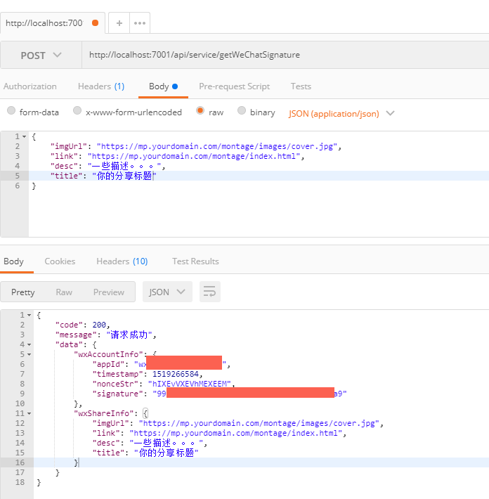

# 基于egg.js微信分享API封装

## 开发
```js
npm i
npm run serve
```

## API访问
```js
1.地址:
http://localhost:7001/api/service/getWeChatSignature

2.方式: POST

3.请求参数: 
{
     link: 'https://www.yourdomain.com/montage/index.html',              // 分享链接
     imgUrl: 'https://www.yourdomain.com/montage/images/cover.jpg',      // 分享封面图片
     title: '你的分享标题',                                               // 分享标题
     desc: '一些描述...'                                                  // 分享描述
}

4.返回结果:
{
    "code":200,
    "message":"请求成功",
    "data":{
        "wxAccountInfo":{
            "appId":"wc7889bc60f",      // appid
            "timestamp":1519265659,     // 时间截
            "nonceStr":"M4vhCXM",       // 加密字符串
            "signature":"f5617cf42f"    // 比对签名
        },
        "wxShareInfo":{
            "imgUrl":"https://mp.yourdomain.com/montage/images/cover.jpg",  // 分享封面地址
            "link":"https://mp.yourdomain.com/montage/index.html",          // 分享链接地址
            "desc":"一此描述。。。",                                         // 分享描述
            "title":"分享标题"                                              // 分享标题  
        }
    }
}
```

## 签名配置
```js
    // config.default.js
    config.weChatShare = {
        appId: 'your appid',            // appid
        appsecret: 'your app scret',    // appscret
    }
```

## 预览


## 参考:
```js
https://mp.weixin.qq.com/wiki?t=resource/res_main&id=mp1421141115
```

